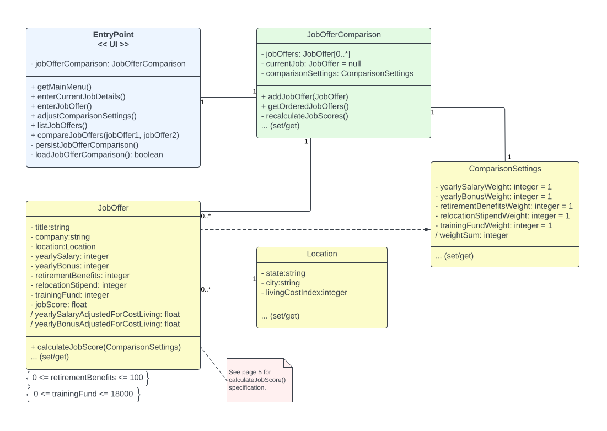
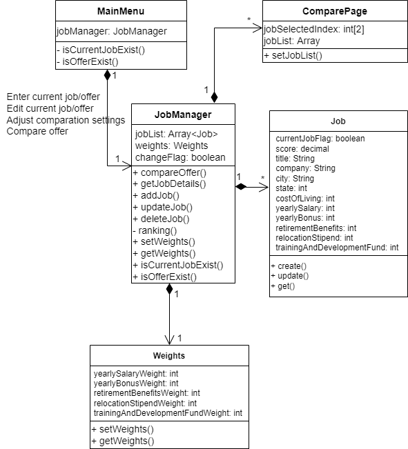
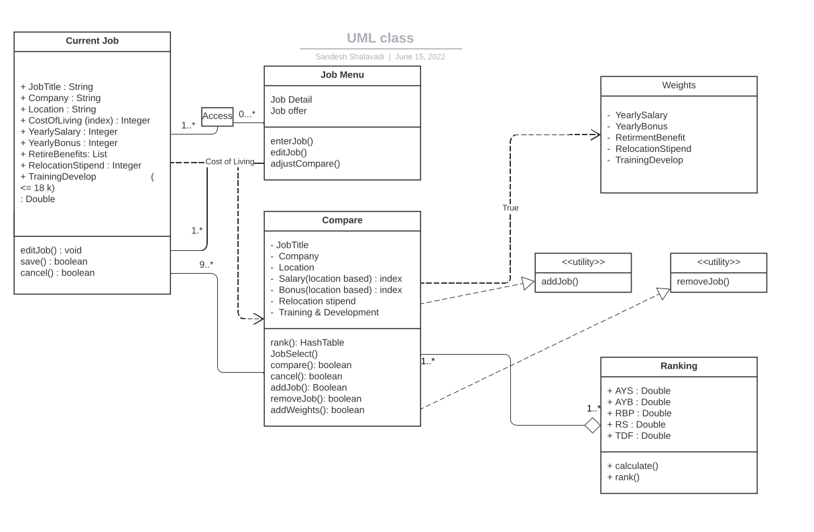
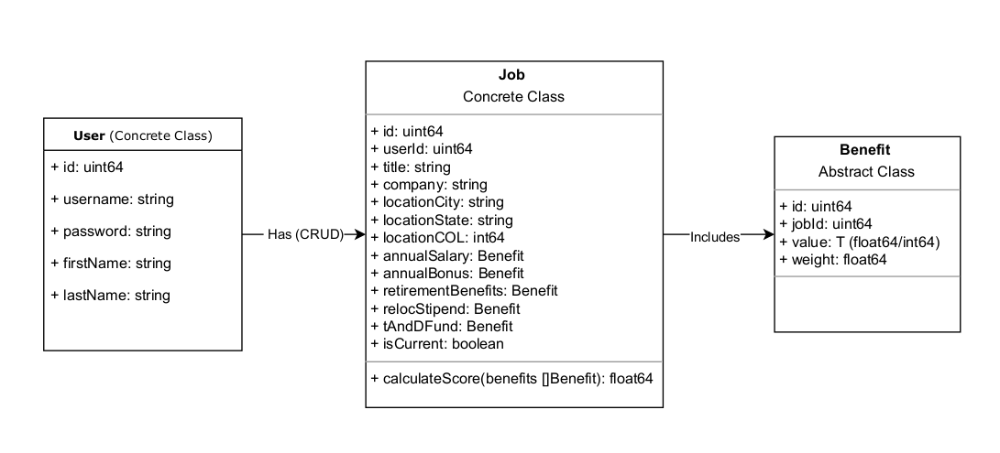

# Team 035 – Design Discussion – Week 1 
## Individual designs
### Design 1: rfreitas3 

Pros: 
* Good adherence to the specification 
* Clear separation of attribution between classes 

Cons: 
* Extra complexity with unnecessary class "JobOfferComparison" 
* Extra component "Application Controller" 

### Design 2: xliu832 

Pros: 
* Simple, covered most of the requirements. 

Cons: 
* UI elements related design like when the button should be disabled is not required in class diagram, this can be handled by GUI.  
* Location can be a separate class to keep consistency in same location. 

 

### Design 3: sshalavadi3 

Pros: 
* Applies attributes of requirements that were displayed on assignment instructions with separation of classes based on different function calls 
* Defined relationships with related subclasses, but did not include shared data types  

Cons: 
* Extra degree of complexity due to addition of weights class without needed parameters that are to be changed 
* No separate class for relation between weights and comparison with ranking system 
* Unsure where to apply ranking formula as part of ranking list or job comparison, and how that metric will align with the weights  

### Design 4: mwong82 

Pros: 
* Flexible for an application with a multi-user use case. 
* Location is only represented as fields in the job, since there are only 3, and it doesn’t need its own utility class. 
* Allows different jobs to have different weights. 

Cons: 
* Doesn’t include CRUD operations, but CRUD operations don’t look required in the assignment requirements. 
* User-specific class, which isn’t necessary for a single-user case. 
* Allowing different jobs to have different weights may not be necessary, since this is only user input and we want to allow for arbitrary comparisons, so this shouldn’t be a part of the Job struct. 

## Team Design 

 This design is based on Design 1. The entity classes are the same but with the addition of the attribute "id" in the "JobOffer" class to clearly identify each offer. The main change was the removal of the controller class "JobOfferComparison". Its persistence attribution was moved to the UI class "EntryPoint", and the database/storage interface was abstracted. 

Despite of being absent in the specification, we decided to add three options in the comparison list of job offers, the first to change the current job, the second to update a listed job offer, and the last to delete a job offer. 

We decided to keep the job score within the job offer instance and the score will be calculated after entering or updating the details, so we do not need to recalculate every time we need to show the ordered list of job offers. However, all the scores need to be recalculated when the comparison settings are changed. 

We also decided to represent all numeric valued benefits as floats instead of integers, because we cannot assume that they will be integers.  

In addition, we updated Design 1’s diagram to show job offer and current job deletion support. 

It was also suggested to not represent the current job as a pointer to an index of jobs, but rather just have an attribute, like isCurrentJob to identify it. There are pros and cons to this depending on how we choose to manage the data; for example, whether we choose to store data in memory or in a persistent database. If we store this in a database and simply keep a pointer to the current job, each time we perform a delete or create operation, we may need to update this pointer. However, searching the database for this document could be costly depending on the type of database we choose. If we persist the data in memory, it may be sufficient to just use a pointer. We will defer this decision until we reach the implementation stage of the project and better understand the requirements. 

## Summary 

Learned lessons: 

* Teamwork is excellent to find blind spots in individual designs and construct concise and assertive solutions. 

* Active listening is a skill that needs practice and is essential for team success. 

 

 

 