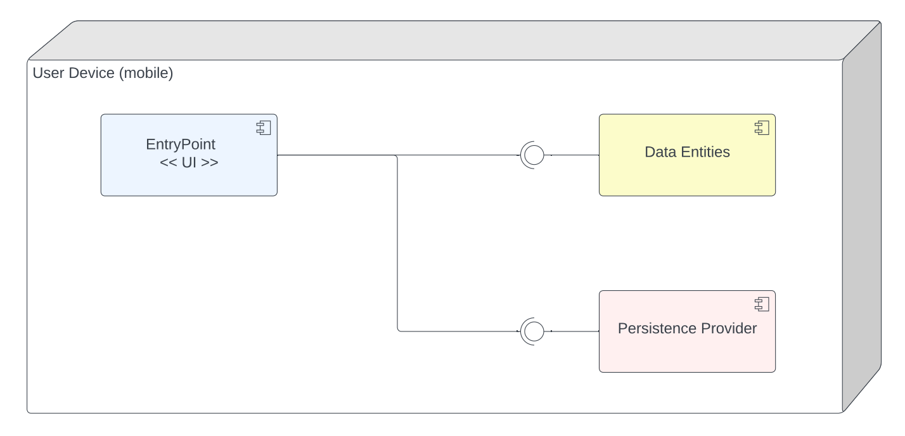

# Design Document

## 1 Design Considerations

### 1.1 Assumptions

- Single device application
- Single user application

### 1.2 Constraints

- User Interface needs to be responsible
- App state needs to be persistent between executions

### 1.3 System Environment

- Android API 30 or newer

## 2 Architectural Design

### 2.1 Component Diagram

- EntryPoint (UI): this is the User Interface component, implemented as an Android App with multiple screens (activities).
- Data Entities: Java classes representing the entities and business rules.
- Persistence Provider: Data Access Objects (DAO) implemented as Java interfaces to use the Android persistence framework Room to deal with SQLite database.

### 2.2 Deployment Diagram

This is a single device mobile application, so all the components are deployed in the same device.

## 3 Low-Level Design

### 3.1 Class Diagram

### 3.2 Other Diagrams

## 4 User Interface Design

### Main menu

### Job Details (form)

### Comparison Settings

### Jobs List

### Delete a Job

### Compare Jobs

