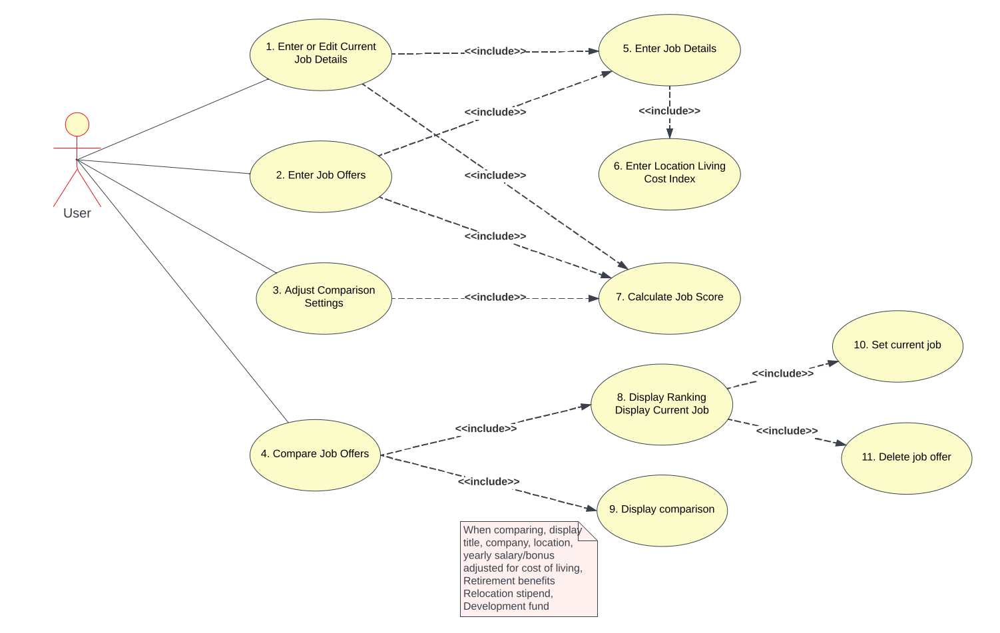

# Use Case Model

## 1 Use Case Diagram

## 2 Use Case Descriptions

### 1 Enter or Edit Current Job Details

- Requirements: Allow user to enter the first job offer details, or edit current job details.
- Pre-conditions: If there is a current job, this job offer will be edited. Otherwise, a new job offer will be entered.
- Post-conditions: The job details are saved in the database and the current job is set.
- Scenarios:
    - If empty job offers database (no **current job**):
        - User access the Main menu (initial screen)
        - Access "Enter or Edit Current Job Details"
        - Fill the job details form *(see [Use Case 5](#5-enter-job-details))*, including the location information *(see [Use Case 6](#6-enter-locations-living-cost-index))*
        - Save the form
        - A new job offer is saved in the database
        - The new job is set as **current job**
    - If **current job** is set:
        - User access the Main menu (initial screen)
        - Access "Enter or Edit Current Job Details"
        - Update the job details form *(see [Use Case 5](#5-enter-job-details))*, including the location information *(see [Use Case 6](#6-enter-locations-living-cost-index))*
        - Save the form
        - The current job is update in the database

### 2 Enter Job Offers

- Requirements: Allow user to enter new job offers.
- Pre-conditions: *(none)*.
- Post-conditions: The new job offer is saved in the database and the current job is set.
- Scenarios:
    - User access the Main menu (initial screen)
    - Access "Enter Job Offers"
    - Fill the job details form *(see [Use Case 5](#5-enter-job-details))*, including the location information *(see [Use Case 6](#6-enter-locations-living-cost-index))*
    - Save the form
    - A new job offer is saved in the database
    - The new job is set as **current job**

### 3 Adjust Comparison Settings

- Requirements: Allow user to adjust the weight of each comparison parameter.
- Pre-conditions: *(none)*
- Post-conditions: The new comparison settings are saved in the database.
- Scenarios:
    - User access the Main menu (initial screen)
    - Access "Adjust Comparison Settings"
    - Fill the weights for each parameter
    - Save the form
    - The comparison settings saved in the database
    - All job scores are calculated *(see [Use Case 7](#7-calculate-job-score))*

### 4 Compare Job Offers

- Requirements: Allow user to see the ordered job offers list and choose two job offers to compare.
- Pre-conditions: At least two job offers exist in the database.
- Post-conditions: No changes after this use case.
- Scenarios:
    - User access the Main menu (initial screen)
    - Access "Compare Job Offers"
    - View the job list *(see [Use Case 8](#8-display-ranking))*
    - Can mark two job offers and click **Compare** *(see [Use case 9](#9-display-comparison))*

### 5 Enter Job Details

- Requirements: Allow user to enter or edit job details.
- Pre-conditions: *(the same as the calling use case)*
- Post-conditions: The job details are validated and ready to be saved in the database.
- Scenarios:
    - User is presented with all job details fields
    - Fill the details
    - Click "Save"
    - All fields are validated
    - Any error is reported to the user

### 6 Enter Locations Living Cost Index

- Requirements: Allow user to enter city, state and living cost index of a location.
- Pre-conditions: *(none)*
- Post-conditions: The location is saved/updated in the database.
- Scenarios:
    - The location form is shown inside another form
    - Enter city, state, and living cost index
    - Click parent form button "Save"
    - The location is searched in the database
    - If not found, a new location is saved
    - If found, the location is updated with the new living cost index

### 7 Calculate Job Score

- Requirements: The job score is updated after an update in the job details or in the comparison settings.
- Pre-conditions: *(none)*
- Post-conditions: Job score is updated reflecting the comparison settings and job details.
- Scenarios:
    - User changes the comparison settings *(see [Use Case 3](#3-adjust-comparison-settings))* or enter/update job details *(see [Use Case 1](#1-enter-or-edit-current-job-details) and [Use Case 2](#2-enter-job-offers))*
    - Click "Save"
    - The job score is updated:
        - If changing one job offer detail, only the affected job is updated
        - If changing comparison settings, all jobs in the database are updated

### 8 Display Ranking

- Requirements: Show the ordered job offers by job score (highest first).
- Pre-conditions: There are at least two job offers in the database.
- Post-conditions: Two selected jobs can be selected.
- Scenarios:
    - The job list is shown
    - User can mark two jobs in the list

### 9 Display Comparison

- Requirements: A comparison table is shown with the two select jobs data.
- Pre-conditions: There are two job offers selected in the job list.
- Post-conditions: *(no changes)*
- Scenarios:
    - Two job offers marked
    - Click "Compare"
    - The comparison table is shown

### 10 Set Current Job

- Requirements: The current job is set to the selected job.
- Pre-conditions: There are a job offer selected in the job list.
- Post-conditions: The current job will be changed.
- Scenarios:
    - One job offer marked
    - Click "Set current"
    - The current job is changed

### 11 Delete Job Offer

- Requirements: The selected job is removed from database.
- Pre-conditions: There are a job offer selected in the job list.
- Post-conditions: The selected job is removed from database. If it was the current job, the current job will be unset.
- Scenarios:
    - One job offer marked
    - Click "Delete"
    - The job is deleted

### 12 Cancel Comparison

- Requirements: User has entered Job Details for Job Offer and has option to "Cancel"
- Pre-conditions: At least one Job Detail field has been filled out in Job Details form
- Post-conditions: Job Detail that user was editing will remove information from all the Job Detail fields and will be empty apart from the Title of Position and the Company
- Scenarios:
    - User access the Main menu (initial screen)
    - Access "Enter Job Offers"
    - User add Job Offer title and position, but have option to "cancel" and remove all information from fields
        
### 13 Disable "Compare"

- Requirements: There will not be more than one job displayed in the database. 
- Pre-conditions: There is a single job offer selected in the job list.
- Post-conditions: The compare button will be disabled and not usable as there are not atleast two jobs in the database currently. 
- Scenarios:
    - One job offer listed
    - Click "Compare" (see User Case 4) for applicable senarios where "Compare" is enabled
    - "Compare" is not applicable
